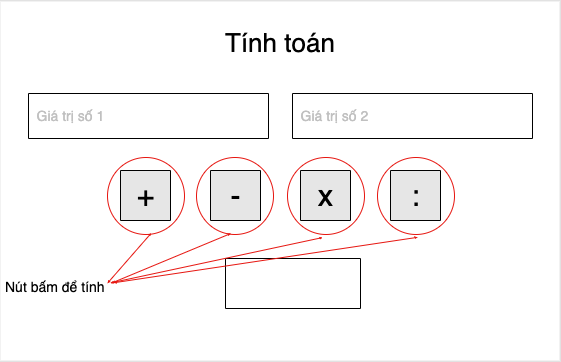
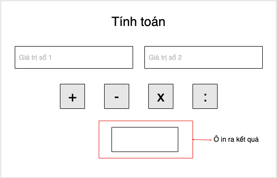
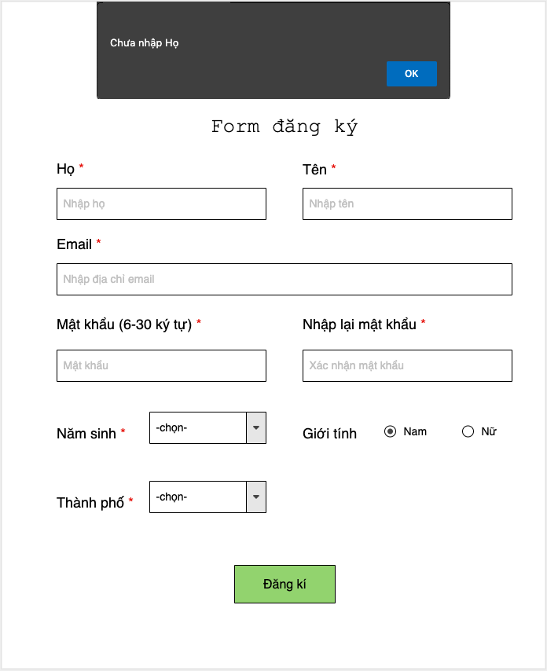

# prj192x_03_vn-javascript-html-form

 This folder contains my submission to the assignment 2 + 3 `Calculator` and `Register Form` in the course PRJ192x_03_VN (Build First App with Javascript), a part of the path Software Engineering provided by FUNiX.

## About the project

- This project contains two separate parts: Calculator and Register Form. These are built in HTLM with form and event handler in Javascript.
- **Keyword**: _javascript, DOM, jQuery, DOM manipulation, HTML, onClick, event handler_.

## Functional description
The project consists of 2 part:
1. <a href="PRF192x_Project_2_FX07929/PRF192x_Project_2_FX07929.html">_**Calculator**_ (folder PRF192x_Project_2_FX07929)</a> has 2 input areas with buttons corresponding to some math operators. When clicking a specific button, the respective operation will be done on 2 inputs.

**_Notes:_** Some special cases must be included in event handler, for instance, the division with zero (0).

|   |     |
| :------------- | :------------- |

2. <a href="PRF192x_Project_2_FX07929/PRF192x_Project_2_FX07929.html">_**Register Form**_ (PRF192x_Project_3_FX07929)</a> is a simple form to get inputs from users, including surname, first name, email, password, year of birth, gender, city and submit button.

**_Notes:_** There should be some validators for some inputs, namely:
- the length of surname, first name, password must be 2-30 character long
- email must be follow the pattern `<something>@<something>.<something>`
- all fields must have specific values

## Demo

The demo video can be seen via: https://www.youtube.com/watch?v=Go0IoFqWpWo

## Further enhancement
- Modify for better user interface
